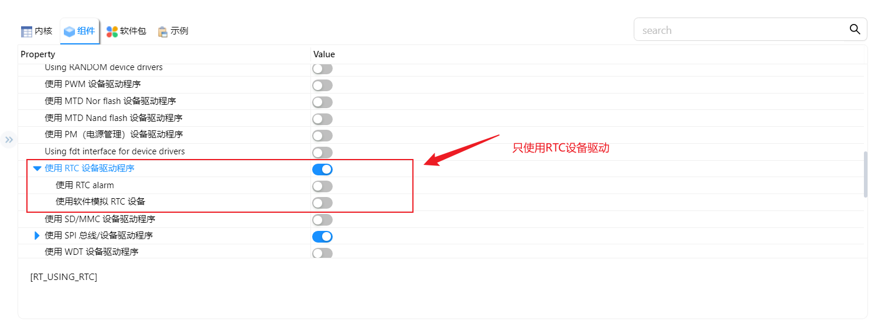
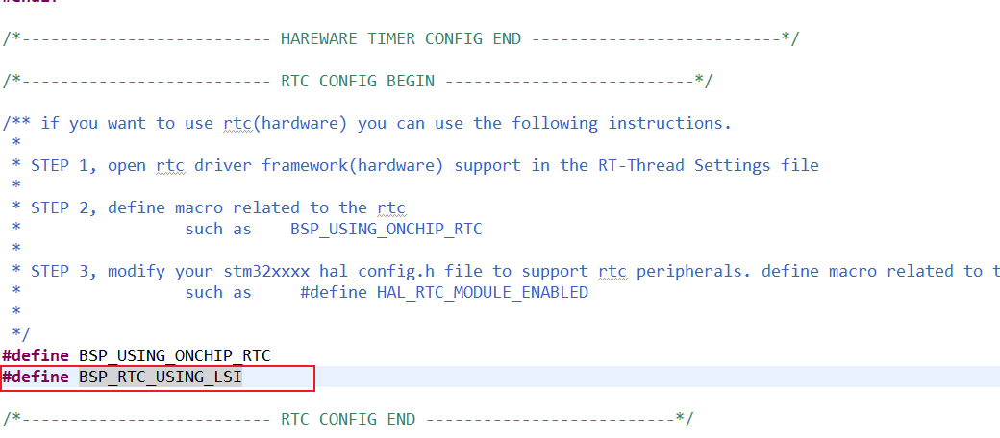
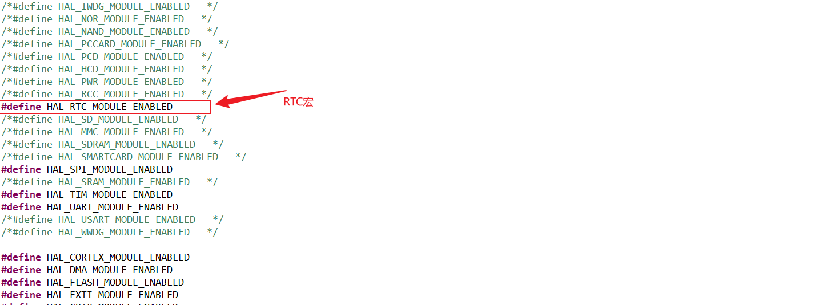
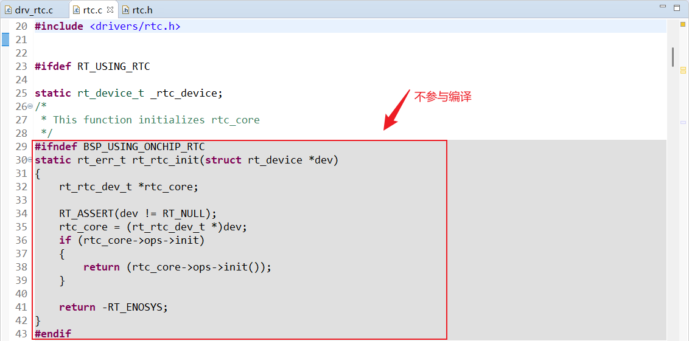
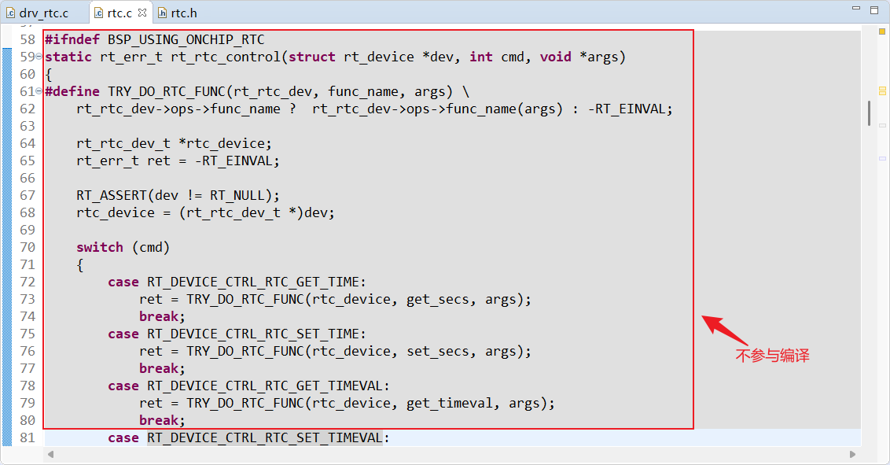
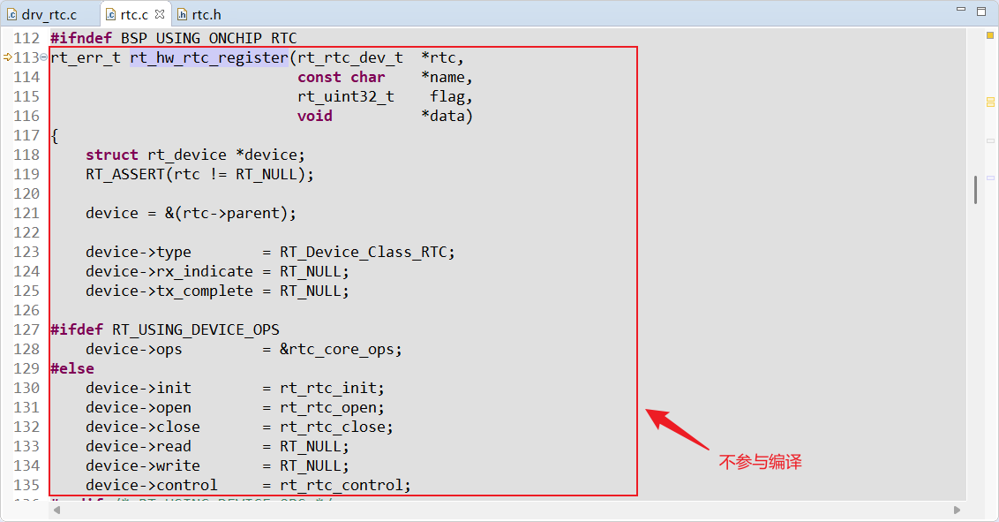
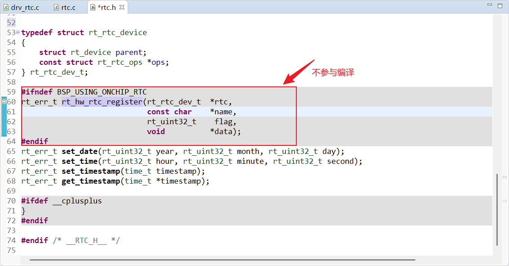

<style>
.red {
  color: #ff0000;
}
.green {
  color:rgb(10, 162, 10);
}
.blue {
  color:rgb(17, 0, 255);
}

.wathet {
  color:rgb(0, 132, 255);
}
</style>

# <span class="green"><font size=3>一、环境选择与配置</font></span>

```bash
create_at： 2025/08/28
aliases：   使用RT-Thread Studio 进行RTC的配置
hardware:   stm32f103ret6
aim:        本次测试目的是配置片上RTC，然后兼容RTT的ulog组件，输出时间戳
```

## <font size=2>1.CubeMX配置</font>

<font size=2>
打开RTT中的CubeMX插件，点击Timers，选择 RTC ，把配置项中的 Activate Clock Source 勾选，然后下面的 Configuration 配置项保持默认，生成代码。
</font>


## <font size=2>2.RTT代码修缮</font>

<font size=2>使用CubeMX完成代码生成后，删除会导致程序报错的代码后，对 RTC 组件相关的配置进行修改。
配置步骤如下：

1. 点击```RT-Thread Settings```，进入到组件配置，选择设备驱动程序，找到```使用RTC设备驱动程序```，然后开启，保存；


2. 点击```board.h```头文件，找到```RTC CONFIG BEGIN```配置项，去除```#define BSP_USING_ONCHIP_RTC```的注释；
如果CPB板上的STM32单片机没有外接32.768kHz的晶振，需要在```board.h```文件中添加```#define BSP_RTC_USING_LSI```宏，因为，RTT官方默认使用了外部晶振；


3. 在cubemx生成的文件夹中找到```stm32f1xx_hal_conf.h```，查看```#define HAL_RTC_MODULE_ENABLED```是否被启用，这里需要被启用；


4. 由于RTT官方在内核中默认定义了在片内RTC注册以及初始化相关的函数，因此在设置上面的步骤2后，在 ```drv_rtc.c```中会对 ```rt_rtc_init()```,```rt_rtc_control()```,```rt_hw_rtc_register()```这三个函数进行重新定义，编译时会产生报错，因此进入```rt-thread --> components --> drivers --> rtc --> rtc.h```文件，添加```board.h```头文件，并在上述三个会被重复定义的函数上添加```#ifndef BSP_USING_ONCHIP_RTC  ....  #endif```宏定义块，以避免重复定义。
==static rt_err_t rt_rtc_init(struct rt_device *dev)==

==static rt_err_t rt_rtc_control(struct rt_device *dev, int cmd, void *args)==

==rt_err_t rt_hw_rtc_register(rt_rtc_dev_t *rtc, const char *name, rt_uint32_t flag, void *data)==


</font>


## <font size=2>3.测试代码</font>

<font size=2>仿照如下代码进行编写即可</font>

```C
/*
 * 程序清单：这是一个 RTC 设备使用例程
 * 例程导出了 rtc_sample 命令到控制终端
 * 命令调用格式：rtc_sample
 * 程序功能：设置RTC设备的日期和时间，延时一段时间后获取当前时间并打印显示。
*/

#define RTC_NAME       "rtc"

static int rtc_sample(int argc, char *argv[])
{
    rt_err_t ret = RT_EOK;
    time_t now;
    rt_device_t device = RT_NULL;

    /*寻找设备*/
    device = rt_device_find(RTC_NAME);
    if (!device)
    {
      LOG_E("find %s failed!", RTC_NAME);
      return RT_ERROR;
    }

    /*初始化RTC设备*/
    if(rt_device_open(device, 0) != RT_EOK)
    {
      LOG_E("open %s failed!", RTC_NAME);
      return RT_ERROR;
    }

    /* 设置日期 */
    ret = set_date(2018, 12, 3);
    if (ret != RT_EOK)
    {
        rt_kprintf("set RTC date failed\n");
        return ret;
    }

    /* 设置时间 */
    ret = set_time(11, 15, 50);
    if (ret != RT_EOK)
    {
        rt_kprintf("set RTC time failed\n");
        return ret;
    }

    /* 延时3秒 */
    rt_thread_mdelay(3000);

    /* 获取时间 */
    now = time(RT_NULL);
    rt_kprintf("%s\n", ctime(&now));

    return ret;
}
/* 导出到 msh 命令列表中 */
MSH_CMD_EXPORT(rtc_sample, rtc sample);
```


